# Kraper: AI-Powered Academic Research Assistant

  

## 📖 Project Overview

**Kraper** is an advanced AI-powered platform designed to democratize academic writing. It automates the generation of IEEE-formatted research papers, helps users find relevant conferences, and assists in structuring complex academic arguments.

By combining **RAG (Retrieval-Augmented Generation)** with **Multi-Agent Orchestration**, Kraper ensures that generated content is not just grammatically correct but technically grounded, cited, and structurally sound.

### 🚀 The Problem
- **Writer's Block:** Students and researchers struggle to start writing complex sections.
- **Formatting Hell:** Adhering to strict IEEE/Springer formats is tedious.
- **Discovery:** Finding the right customized list of conferences for a niche topic is difficult.

### 💡 The Solution
A unified workspace where users provide a research topic, and Kraper:
1.  **Generates** full paper sections (Abstract, Methodology, etc.) using grounded RAG.
2.  **Scrapes** real-time conference data relevant to the topic.
3.  **Refines** content to meet academic standards.

---

## 🎥 Project Showcase

> **[🚀 Live Product Demo](https://kraper.netlify.app/)**
> *Experience the AI-powered research assistant in action. Generate papers and find conferences instantly.*
>
> **[📹 Video Prototype](https://drive.google.com/file/d/1Kp19ZJYyGT1bmJ_jltMo4DgBcBKUb6im/view?usp=sharing)**
> *Watch a comprehensive walkthrough of the core features and user journey.*
>
> **[📊 Pitch Deck](https://www.canva.com/design/DAHABce4mag/8UNFyXMu17nuVv95FoYi4A/edit?utm_content=DAHABce4mag&utm_campaign=designshare&utm_medium=link2&utm_source=sharebutton)**
> *View our presentation covering the vision, problem statement, solution architecture, and market analysis.*

---

## 🏗️ System Architecture

Kraper uses a decoupled microservices architecture optimized for cloud deployment.

```mermaid
graph TD
    User["👤 User"] -->|HTTPS| Frontend["🖥️ Next.js Frontend (Netlify)"]
    Frontend -->|Direct API Call| Backend["🐍 Python RAG Service (Render)"]
    
    subgraph "Cloud Backend Layer"
        Backend -->|Query| Router["⚡ FastRouter / LLM Gateway"]
        Router -->|Inference| Llama3["🦙 Llama-3-8B-Instruct"]
        Backend -->|Similarity Search| FAISS["📚 FAISS Vector Store"]
        Backend -->|Scrape| WikiCFP["🌐 WikiCFP / OpenAlex"]
    end
    
    subgraph "Data Pipeline"
        PDFs["📄 PDF Documents"] -->|Ingest| Embeddings["🔢 Embeddings Model"]
        Embeddings -->|Index| FAISS
    end
```



---

## 🛠️ Technology Stack

### **Frontend (Client-Side)**
-   **Framework:** [Next.js 14](https://nextjs.org/) (React)
-   **Styling:** [Tailwind CSS v4](https://tailwindcss.com/)
-   **Animations:** Framer Motion & GSAP
-   **Deployment:** Netlify

### **Backend (Server-Side)**
-   **Core:** Python Flask
-   **WSGI Server:** Gunicorn (Production)
-   **Vector Store:** FAISS (Facebook AI Similarity Search)
-   **Orchestration:** LangChain
-   **Scraping:** BeautifulSoup4, Requests
-   **Deployment:** Render

### **AI & Models**
-   **LLM:** Llama-3-8B-Instruct (via FastRouter)
-   **Embeddings:** `Claude Sonnet 4 (anthropic/claude-sonnet-4-20250514)`
-   **Routing:** FastRouter (High-availability LLM gateway)

---

## 🧠 Algorithms & Logic

### 1. Retrieval-Augmented Generation (RAG) Flow
Context-aware generation reduces hallucinations by grounding the LLM in real data.

1.  **Ingestion:**
    -   Academic PDFs are loaded from `data/pdfs/`.
    -   Splitted into 1000-character chunks with 200-char overlap.
    -   Converted to vectors using `all-MiniLM-L6-v2`.
2.  **Retrieval:**
    -   User query -> Vector Embedding.
    -   Search FAISS index for top-k (k=5) most similar chunks.
3.  **Generation:**
    -   `Context` + `User Query` + `IEEE Prompt Template` -> LLM.
    -   Output: Formatted academic text with potential citations.

### 2. Multi-Source Conference Scraping
A resilient scraper that aggregates data from multiple sources:


---

## � Key Features

### ✨ **Project Studio**
A dedicated workspace to generate, edit, and export research papers.
-   **Step-by-Step Wizard:** Guides you through Problem Statement -> Methodology -> Results.
-   **Section Generators:** Generate specific sections (e.g., "Write the Literature Review").

### 🔎 **Conference Finder**
Real-time discovery of venues for your work.
-   **Smart Filtering:** Finds conferences based on your specific research domain (e.g., "AI in Healthcare").
-   **Impact Estimation:** Uses AI to estimate impact factors if data is missing.

### 📝 **IEEE Formatting Engine**
-   Ensures output follows "Third-person passive voice".
-   Structures content with proper headers (I. INTRODUCTION, II. METHODOLOGY).

---

## � Installation & Setup

### Prerequisites
-   Node.js 18+
-   Python 3.11+
-   Git

### 1. Clone the Repository
```bash
git clone https://github.com/THEProgrammingGod69/Kraper.git
cd Kraper
```

### 2. Frontend Setup
```bash
cd frontend
npm install
npm run dev
# Running on http://localhost:3000
```

### 3. Backend Setup
```bash
cd ../rag_service
python -m venv venv
# Windows:
venv\Scripts\activate
# Mac/Linux:
# source venv/bin/activate

pip install -r requirements.txt

# Create .env file
cp .env.example .env
# Edit .env with your FASTROUTER_API_KEY
```

### 4. Build Vector Index (Optimization)
Before running the backend, ingest your PDFs to build the FAISS index:
```bash
python core/ingest.py
```

### 5. Start Backend
```bash
python app.py
# Running on http://localhost:5002
```

---

## ☁️ Deployment

### Backend (Render)
1.  Push code to GitHub.
2.  Create new **Web Service** on Render.
3.  **Build Command:** `pip install -r requirements.txt`
4.  **Start Command:** `gunicorn app:app --bind 0.0.0.0:$PORT`
5.  **Environment Variables:**
    -   `PYTHON_VERSION`: `3.11.0`
    -   `FASTROUTER_API_KEY`: `...`
    -   `LLM_PROVIDER`: `fastrouter`

### Frontend (Netlify)
1.  Import repository to Netlify.
2.  **Build Command:** `npm run build`
3.  **Publish Directory:** `.next`
4.  **Environment Variables:**
    -   `NEXT_PUBLIC_API_URL`: `https://your-render-backend.onrender.com`

---

## �️ License

Distributed under the MIT License. See `LICENSE` for more information.

---

**Developed by the Kraper Team**
---
Arnav Sirse
--- 
Arya Ambekar 
---